## 一、目的

实验搭建基于 Apache 服务器的各类认证环境，主要是 Basic、LDAP 以及 Radius

## 二、环境

[xampp](https://www.apachefriends.org/index.html)、[OpenLDAP](http://www.openldap.org/)、[FreeRADIUS](http://freeradius.org/)、Fedora 25 (Workstation Edition)

## 三、要求

1.  建议在 Linux 环境下完成实验（推荐顺序是 Fedora>Ubuntu>其他 Linux 发行版>Kali or
    BT )。windows 下如果能搞定配置也是可以接受的。
2.  用 openldap 搭建 LDAP 服务器，尝试对学生信息进行增删改查，信息包括但不限于学生 id、密码、
    邮箱、手机号、部门等。
3.  配置 apache 服务器，配置 Basic 认证模块和需要认证的页面，使用用户名密码认证。
4.  配置 apache 服务器，配置 LDAP 认证模块和需要认证的页面，使用 LDAP 存放的学生的用户名密码
    认证。
5.  用 freeradius 搭建 RADIUS 服务器，尝试配置基于 unix 账号的认证，并用 radtest 验证服务有效。
6.  配置 apache 服务器，配置 RADIUS 认证模块和需要认证的页面，使用 unix/Linux 本地用户名密码
    认证。
7.  在 freeradius 中配置 ldap 认证模块，和 LDAP 服务器互通，利用 ldap 账号密码认证用户身份，并用
    radtest 测试通过。
8.  在之前 apache 的 RADIUS 认证模块的配置下，不改变配置，切换到使用 LDAP 存放的学生用户名密
    码认证，体会这种配置和 3 的不同。
    以下为选做：
9.  在 ROS 的 AP 下，通过配置与 RADIUS 服务器连接，是学生可以通过存放在 LDAP 中的用户名密码
    来通过认证接入 wifi。

<!-- more -->

## 四、内容

### 0x01 Basic 认证

#### 1.简介

在 HTTP 中，基本认证（Basic access authentication）是一种用来允许网页浏览器或其他客户端程序在请求时提供用户名和口令形式的身份凭证的一种登录验证方式。编码这一步骤的目的并不是安全与隐私，而是为将用户名和口令中的不兼容的字符转换为均与 HTTP 协议兼容的字符集。

#### 2.操作

首先执行 `mkdir /opt/lampp/basic/` 建立目录

然后在`/opt/lampp/etc/httpd.conf`尾部添加如下内容

```
Alias /basic "/opt/lampp/basic"

<Directory "/opt/lampp/basic">
Options Indexes FollowSymLinks
AllowOverride all
Order allow,deny
Allow from all
</Directory>
```

在`/opt/lampp/basic`目录下，建立.htaccess 文件，内容如下

```
<Files ~ "^\.(htaccess|htpasswd)$">
deny from all
</Files>
AuthUserFile /opt/lampp/basic/.htpasswd
AuthGroupFile /dev/null
AuthName "Please enter your ID and password"
AuthType Basic
require valid-user
order deny,allow
```

使用`/opt/lampp/bin/htpasswd`工具生成密码文件

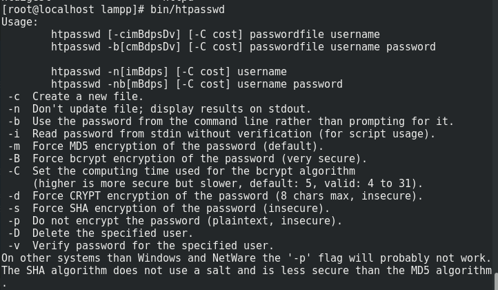

可以使用`htpasswd -b /opt/lampp/basic/.htpasswd name pass`生成需要的文件

使用`/opt/lampp reloadapache`重启 Apache2，访问[Basic](http://localhost/basic/)

发现有身份认证请求

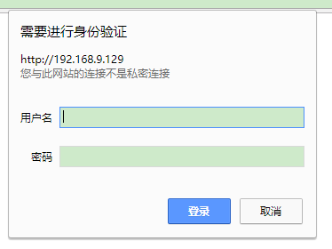

输入之前生成密码文件时所使用的账号和密码，即可进入认证后的页面

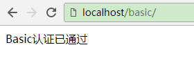

至此，简单的 Basic 认证测试完成

### 0x02 OpenLDAP 认证

#### LDAP 服务器配置

首先安装 LDAP 认证服务器

```bash
sudo dnf install -y openldap openldap-clients openldap-servers migrationtools
```

OpenLDAP 的相关配置文件信息

```
/etc/openldap/slapd.conf：OpenLDAP的主配置文件，记录根域信息，管理员名称，密码，日志，权限等
/etc/openldap/slapd.d/*：这下面是/etc/openldap/slapd.conf配置信息生成的文件，每修改一次配置信息，这里的东西就要重新生成
/etc/openldap/schema/*：OpenLDAP的schema存放的地方
/var/lib/ldap/*：OpenLDAP的数据文件
/usr/share/openldap-servers/slapd.conf.obsolete 模板配置文件
/usr/share/openldap-servers/DB_CONFIG.example 模板数据库配置文件

OpenLDAP监听的端口：
默认监听端口：389（明文数据传输）
加密监听端口：636（密文数据传输）
```

准备 LDAP 数据库

使用`slappasswd`命令生成密码

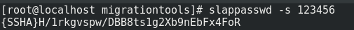

在`/usr/share/openldap-servers/slapd.ldif`的结尾添加密码

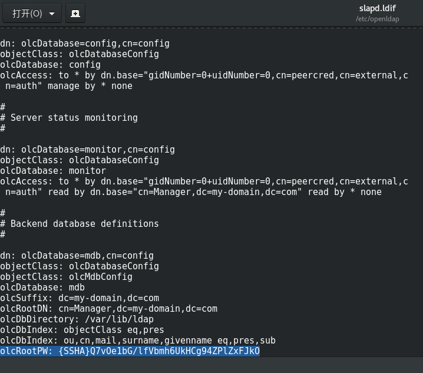

使用如下命令重建数据库

```bash
rm /var/lib/ldap -rf
cp /usr/share/openldap-servers/DB_CONFIG.example /var/lib/ldap/DB_CONFIG # 拷贝数据库配置文件
slapadd -n 0 -F /etc/openldap/slapd.d -l /usr/share/openldap-servers/slapd.ldif
chown -R ldap.ldap /var/lib/ldap # 修改目录权限
slaptest -u
service slapd restart # 重启OpenLDAP
```

生成域名 DIT base.ldif 文件

```bash
/usr/share/migrationtools/migrate_base.pl > /root/base.ldif
```

加载 base.ldif 文件到 openldap 数据库

```bash
ldapadd -x -W -D "cn=Manager,dc=my-domain,dc=com" -f /root/base.ldif
```

启动及设置开机自启动启动服务

```bash
systemctl start slapd
systemctl enable slapd
```

查看启动状态及监听端口

```bash
systemctl status slapd.service
netstat -anpt |grep slapd
```

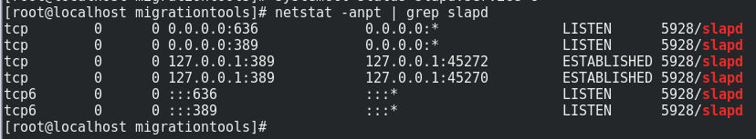

添加下面的 LDAP 数据库

```bash
cd /etc/openldap/schema/

ldapadd -Y EXTERNAL -H ldapi:/// -D "cn=config" -f collective.ldif
ldapadd -Y EXTERNAL -H ldapi:/// -D "cn=config" -f corba.ldif
ldapadd -Y EXTERNAL -H ldapi:/// -D "cn=config" -f core.ldif
ldapadd -Y EXTERNAL -H ldapi:/// -D "cn=config" -f cosine.ldif
ldapadd -Y EXTERNAL -H ldapi:/// -D "cn=config" -f duaconf.ldif
ldapadd -Y EXTERNAL -H ldapi:/// -D "cn=config" -f dyngroup.ldif
ldapadd -Y EXTERNAL -H ldapi:/// -D "cn=config" -f inetorgperson.ldif
ldapadd -Y EXTERNAL -H ldapi:/// -D "cn=config" -f java.ldif
ldapadd -Y EXTERNAL -H ldapi:/// -D "cn=config" -f misc.ldif
ldapadd -Y EXTERNAL -H ldapi:/// -D "cn=config" -f nis.ldif
ldapadd -Y EXTERNAL -H ldapi:/// -D "cn=config" -f openldap.ldif
ldapadd -Y EXTERNAL -H ldapi:/// -D "cn=config" -f pmi.ldif
ldapadd -Y EXTERNAL -H ldapi:/// -D "cn=config" -f ppolicy.ldif
```

修改配置文件`/usr/share/migrationtools/migrate_common.ph`

```
修改71行：
$DEFAULT_MAIL_DOMAIN = "my-domain.com";
修改74行：
$DEFAULT_BASE = "dc=my-domain,dc=com";
```

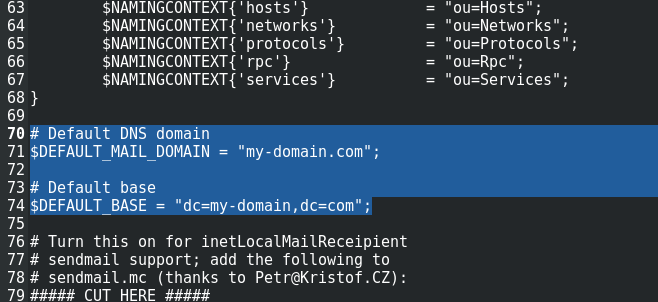

生成域名 base.ldif 文件

```
/usr/share/migrationtools/migrate_base.pl > /root/base.ldif
```

加载 base.ldif 文件到 openldap 数据库

```
ldapadd -x -W -D "cn=Manager,dc=my-domain,dc=com" -f /root/base.ldif
```

创建用户并设置密码

```
mkdir /home/guests
useradd -d /home/guests/ldapuser1 ldapuser1
useradd -d /home/guests/ldapuser2 ldapuser2
useradd -d /home/guests/hongxue hongxue

echo 'password' | passwd --stdin hongxue
echo 'password' | passwd --stdin ldapuser1
echo 'password' | passwd --stdin ldapuser2
```

过滤出用户信息并保存

```
getent passwd | tail -n 3 > /root/users
getent shadow | tail -n 3 > /root/shadow
getent group  | tail -n 3 > /root/groups
```

通过用户信息并生成 ldif 文件

```
cd /usr/share/migrationtools/
./migrate_passwd.pl /root/users > users.ldif
./migrate_group.pl /root/groups > groups.ldif
```

更新这些用户和组的 LDIF 文件到 LDAP 数据库

```
ldapadd -x -W -D "cn=Manager,dc=my-domain,dc=com" -f users.ldif
ldapadd -x -W -D "cn=Manager,dc=my-domain,dc=com" -f groups.ldif
```

搜索 LDAP DIT 的所有记录

```
ldapsearch -x -b "dc=my-domain,dc=com" -H ldap://127.0.0.1
```

#### Apache 配置

执行 `mkdir /opt/lampp/ldap/` 建立目录

然后在`/opt/lampp/etc/httpd.conf`尾部添加如下内容

```
Alias /ldap "/opt/lampp/ldap"

<Directory "/opt/lampp/ldap">
Options Indexes FollowSymLinks
AllowOverride all
Order allow,deny
Allow from all
</Directory>
```

在`/opt/lampp/ldap`目录下，建立.htaccess 文件，内容如下

```
AuthType Basic
AuthName "Test Login"
AuthBasicProvider ldap
AuthLDAPURL ldap://127.0.0.1:389/ou=People,dc=my-domain,dc=com
require valid-user
```

访问`http://localhost/ldap/`，发现需要认证

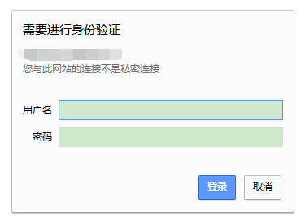

使用刚才生成的三个账户中任意一组均可登陆成功

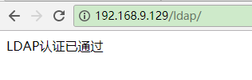

### 0x03 RADIUS

首先安装 FreeRADIUS 到 Fedora

```
sudo yum -y install freeradius freeradius-ldap freeradius-utils -y
```

由于要配置基于 UNIX 密码的认证，所以我们要在如下几个地方进行修改

1.  /etc/raddb/radiusd.conf

```
user = root
group = root
```

因为在这种认证方式的时候需要读取`/etc/shadow`文件，所以需要高权限用户

2.  /etc/raddb/mods-available/pam

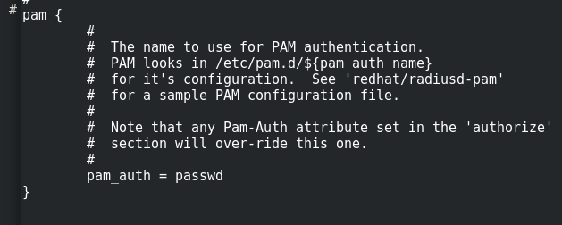

主要是要把认证方式改为 passwd

这时候还需要执行一条命令来启动这个模块

```
ln -s /etc/raddb/mods-available/pam /etc/raddb/mods-enabled/pam
```

3.  /etc/raddb/sites-enabled/default

把 PAM 前面的注释符去掉


4.  /etc/raddb/users

在文件的开头写上

```
DEFAULT Auth-Type = PAM
        Fall-Through = Yes
```

文件修改完成后即可启动 radius

```
radiusd -X
```

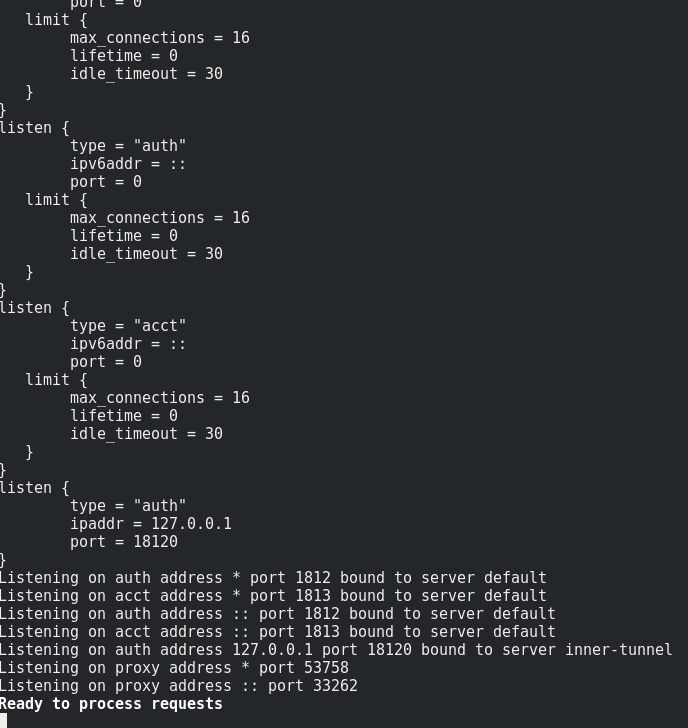

使用 radtest 进行测试，命令参数如下

```
Usage: radtest [OPTIONS] user passwd radius-server[:port] nas-port-number secret [ppphint] [nasname]
        -d RADIUS_DIR       Set radius directory
        -t <type>           Set authentication method
                            type can be pap, chap, mschap, or eap-md5
        -P protocol         Select udp (default) or tcp
        -x                  Enable debug output
        -4                  Use IPv4 for the NAS address (default)
        -6                  Use IPv6 for the NAS address
```

在这里我的测试命令为：

```
radtest hongxue password 127.0.0.1 0 testing123
```

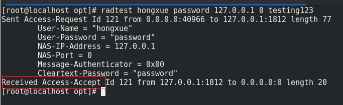

可以看到，已经通过了认证

#### Apache 配置

先编译 mod_auth_radius 模块

```
cd /opt/lampp/modules/
wget https://raw.githubusercontent.com/FreeRADIUS/mod_auth_radius/master/mod_auth_radius.c
/opt/lampp/bin/apxs -i -a -c mod_auth_radius.c
```

执行 `mkdir /opt/lampp/radius/` 建立目录

然后在`/opt/lampp/etc/httpd.conf`添加如下内容

在`LoadModule radius_auth_module modules/mod_auth_radius.so`后面添加

```
<IfModule mod_auth_radius.c>
AddRadiusAuth localhost:1812 testing123 5:3
AddRadiusCookieValid 5
</IfModule>
```

在结尾添加

```xml
Alias /radius "/opt/lampp/radius"

<Directory "/opt/lampp/radius">
Options Indexes FollowSymLinks
AllowOverride all
Order allow,deny
Allow from all
</Directory>
```

在`/opt/lampp/radius`目录下，建立.htaccess 文件，内容如下

```
AuthType Basic
AuthName "RADIUS authentication for localhost"
AuthBasicProvider radius
AuthRadiusCookieValid 5
AuthRadiusActive On
require valid-user
```

访问`http://localhost/radius/`，发现需要认证

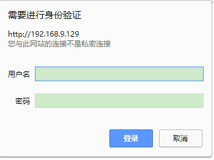

使用系统的用户名和密码进行登录

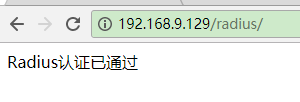

### 0x04 Radius + LDAP

启动 Radius 的 LDAP 模块

```
ln -s /etc/raddb/mods-available/ldap /etc/raddb/mods-enabled/ldap
```

修改`/etc/raddb/sites-enabled/default`，去掉 LDAP 认证模式前面的注释符

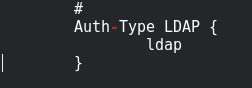

修改`/etc/raddb/users`中的认证方式，改成 LDAP

```
DEFAULT Auth-Type = LDAP
        Fall-Through = Yes
```

修改`/etc/raddb/mods-available/ldap`中，LDAP 的连接信息

```python
identity = 'cn=Manager,dc=my-domain,dc=com'
password = password # 替换成自己的密码

#  Unless overridden in another section, the dn from which all
#  searches will start from.
base_dn = 'ou=People,dc=my-domain,dc=com'
```

重启 RADIUS 服务，使用`radtest`进行连接测试

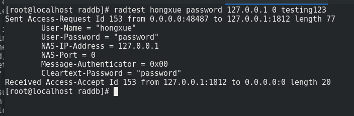

访问`http://localhost/radius/`，发现需要认证


使用 LDAP 的用户名和密码进行登录


## 五、参考

1.  [apache+svn+openldap 整合实现认证](https://blog.csdn.net/wanglei_storage/article/details/52663328)
2.  [OpenLDAP 与 Apache](https://www.cnblogs.com/lemon-le/p/d6278642e3bb67df6033345ed8cba424.html)
3.  [Apache 使用 LDAP 认证](https://blog.csdn.net/tangshiweibbs/article/details/71078746)
4.  [.htaccess Editor](http://www.htaccesseditor.com/sc.shtml)
5.  [HTTP 基本认证 - 维基百科，自由的百科全书](https://zh.wikipedia.org/wiki/HTTP%E5%9F%BA%E6%9C%AC%E8%AE%A4%E8%AF%81)
6.  [解决 Undefined variable: \_SESSION 的方法](https://blog.csdn.net/hxmcnu/article/details/42748189)
7.  [OpenLDAP Software 2.4 Administrator's Guide: A Quick-Start Guide](http://www.openldap.org/doc/admin24/quickstart.html)
8.  [PAM_RADIUS MOD_AUTH_RADIUS](https://freeradius.org/sub_projects/)
9.  [如何配置 Apache 以使用 Radius 进行双因素身份验证](https://www.howtoing.com/apache_radius_two_factor_authentication/)
10. [pam | FreeRADIUS Documentation](https://networkradius.com/doc/3.0.10/raddb/mods-available/pam.html)
11. [freeradius 如何配置 pam 模块 - CSDN 博客](https://blog.csdn.net/sonflower123/article/details/53582045)
12. [FreeRadius+Ldap 整合配置*过客*新浪博客](http://blog.sina.com.cn/s/blog_92dc41ea0101rbl7.html)
