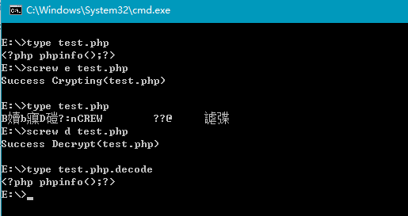
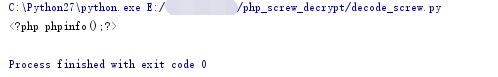
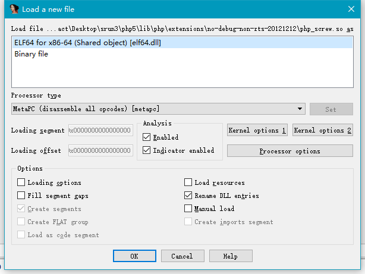
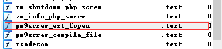
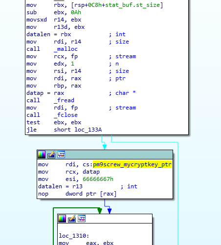
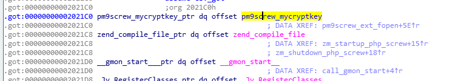
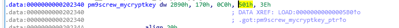
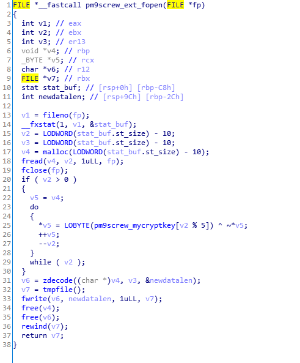

## 0x00 引言

之前分析了 Screw 加密的原理，只是把 inflate 压缩后结果的每一位，按位取反之后，与 pm9screw_mycryptkey 数组中的一位做位异或操作。

因为算法比较简单，其实可以直接逆推出解密算法，不过还是先来看一下官方的解密实现好了。

<!-- more -->

## 0x01 分析

首先，从 Makefile.in 我们能看到源码核心的文件

```Makefile
PHP_SCREW_SHARED_LIBADD = libphpscrewext.so
LTLIBRARY_NAME		= libscrew.la
LTLIBRARY_SOURCES	= php_screw.c zencode.c
LTLIBRARY_SHARED_NAME	= php_screw.la
LTLIBRARY_SHARED_LIBADD	= $(PHP_SCREW_SHARED_LIBADD)

include $(top_srcdir)/build/dynlib.mk

```

zencode.c 之前已经分析过，是用来调用 zlib 库以提供压缩和解压操作的代码，那么`php_screw.c`应该就是包含解密和与 php 交互部分的代码了

```C
Filename: php_screw.c
Line: 25-53

FILE *pm9screw_ext_fopen(FILE *fp)
{
	struct	stat	stat_buf;
	char	*datap, *newdatap;
	int	datalen, newdatalen;
	int	cryptkey_len = sizeof pm9screw_mycryptkey / 2;
	int	i;

	fstat(fileno(fp), &stat_buf);
	datalen = stat_buf.st_size - PM9SCREW_LEN;
	datap = (char*)malloc(datalen);
	fread(datap, datalen, 1, fp);
	fclose(fp);

	for(i=0; i<datalen; i++) {
		datap[i] = (char)pm9screw_mycryptkey[(datalen - i) % cryptkey_len] ^ (~(datap[i]));
	}

	newdatap = zdecode(datap, datalen, &newdatalen);

	fp = tmpfile();
	fwrite(newdatap, newdatalen, 1, fp);

	free(datap);
	free(newdatap);

	rewind(fp);
	return fp;
}
```

## 0x02 Python 实现

如果使用 C 语言，那么只需要截取上边的部分，和`zencode.c`一起就可以编写出解密工具。在 github 上可以找到不少类似的工具。比如：

```
https://github.com/dehydr8/php_unscrew
https://github.com/firebroo/screw_decode
```

不过这些工具都是基于 C 语言的，可移植性就比较差，所以我想用 Python 写一个。

参考网上基于 C 语言的代码，可以用 Python 实现解码

```python
for i in range(datalen):
    tmp = chr((pm9screw_mycryptkey[(datalen - i) % cryptkey_len] ^ (~ord(data[i]))) % 256)
    out += tmp
```

这部分就是主要用来解密的部分了，与 C 语言不同的主要就是对 256 取余，因为 C 语言在强制类型转换的时候，自动把超限的部分取余，而 Python 就得我们自己来了，这也是唯一的难点。

至于解压缩，我们只需要调用 Python 的 zlib 库就可以简单的做到，完整的解密代码如下所示：

```python
def decrypt(path, write=True):
    data = open(path, 'rb').read()

    if len(data) < PM9SCREW_LEN:
        return False

    if data[:PM9SCREW_LEN] != PM9SCREW:
        return False
    data = data[PM9SCREW_LEN:]
    datalen = len(data)
    out = ''
    for i in range(datalen):
        tmp = chr((pm9screw_mycryptkey[(datalen - i) % cryptkey_len] ^ (~ord(data[i]))) % 256)
        out += tmp

    new = zlib.decompress(out)
    if write:
        shutil.move(path, path + ".bak")
        open(path, 'w').write(new)
    else:
        print(new)
```

这是针对一个文件的，所以我们要加入一个函数来支持遍历解码：

```python
def multi_decrypt(path):
    if not os.path.exists(path):
        print('Error: %s not Found.' % path)
        return

    if os.path.isdir(path):
        folder = os.walk(path)

        for fpathe, dirs, fs in folder:
            for f in fs:
                if f.endswith('.php'):
                    decrypt(os.path.join(fpathe, f),False)
    else:
        decrypt(path)
```

最后的成品代码在这里[Link](https://github.com/Skactor/php_screw-decrypt)

## 0x03 C 语言实现

根据网上的代码，我使用 C 语言在 Windows 上重新实现了一遍加密解密，代码如下

```C
#include "zencode.h"
#include <sys/stat.h>
#define PM9SCREW        "\tPM9SCREW\t"
#define PM9SCREW_LEN     10

short pm9screw_mycryptkey[] = {
	11152, 368, 192, 1281, 62
};

int decode_screw(char* filename)
{
	FILE *fp;
	char buf[PM9SCREW_LEN + 1];
	struct stat stat_buf;
	char *datap, *newdatap;
	int datalen, newdatalen;
	int cryptkey_len = sizeof pm9screw_mycryptkey / 2;
	char decode_filename[256];
	int i;

	fp = fopen(filename, "rb");
	if (fp == NULL) {
		fprintf(stderr, "File not found(%s)\n", filename);
		return 0;
	}

	fread(buf, PM9SCREW_LEN, 1, fp);
	if (memcmp(buf, PM9SCREW, PM9SCREW_LEN) != 0) {
		fprintf(stderr, "Not a crypted file.\n");
		fclose(fp);
		return 0;
	}

#ifdef WIN32
	fstat(_fileno(fp), &stat_buf);
#else
	fstat(fileno(fp), &stat_buf);
#endif

	datalen = stat_buf.st_size - PM9SCREW_LEN;
	datap = (char*)malloc(datalen);
	memset(datap, 0, datalen);
	fread(datap, datalen, 1, fp);
	fclose(fp);
	for (i = 0; i < datalen; i++) {
		datap[i] = (char)pm9screw_mycryptkey[(datalen - i) % cryptkey_len] ^ (~(datap[i]));
	}

	newdatap = zdecode(datap, datalen, &newdatalen);
	if (newdatalen)
	{
		sprintf(decode_filename, "%s%s", filename, ".decode");
		fp = fopen(decode_filename, "w");
		fwrite(newdatap, newdatalen, 1, fp);
		fclose(fp);
		fprintf(stderr, "Success Decrypt(%s)\n", filename);
		return 1;
	}
	return 0;
}

int encode_screw(char* filename) {
	FILE	*fp;
	struct	stat	stat_buf;
	char	*datap, *newdatap;
	int	datalen, newdatalen;
	int	cryptkey_len = sizeof pm9screw_mycryptkey / 2;
	char	oldfilename[256];
	int	i;

	fp = fopen(filename, "rb");
	if (fp == NULL) {
		fprintf(stderr, "File not found(%s)\n", filename);
		return 0;
	}

#ifdef WIN32
	fstat(_fileno(fp), &stat_buf);
#else
	fstat(fileno(fp), &stat_buf);
#endif
	datalen = stat_buf.st_size;
	datap = (char*)malloc(datalen + PM9SCREW_LEN);
	fread(datap, datalen, 1, fp);
	fclose(fp);

	sprintf(oldfilename, "%s.screw", filename);

	if (memcmp(datap, PM9SCREW, PM9SCREW_LEN) == 0) {
		fprintf(stderr, "Already Crypted(%s)\n", filename);
		return 0;
	}

	fp = fopen(oldfilename, "w");
	if (fp == NULL) {
		fprintf(stderr, "Can not create backup file(%s)\n", oldfilename);
		return 0;
	}
	fwrite(datap, datalen, 1, fp);
	fclose(fp);

	newdatap = zencode(datap, datalen, &newdatalen);

	for (i = 0; i < newdatalen; i++) {
		newdatap[i] = (char)pm9screw_mycryptkey[(newdatalen - i) % cryptkey_len] ^ (~(newdatap[i]));
	}

	fp = fopen(filename, "w");
	if (fp == NULL) {
		fprintf(stderr, "Can not create crypt file(%s)\n", oldfilename);
		return 0;
	}
	fwrite(PM9SCREW, PM9SCREW_LEN, 1, fp);
	fwrite(newdatap, newdatalen, 1, fp);
	fclose(fp);
	fprintf(stderr, "Success Crypting(%s)\n", filename);
	free(newdatap);
	free(datap);
	return(1);
}

main(int argc, char**argv)
{
	if (argc != 3) {
		fprintf(stderr, "Usage: %s e/d filename.\n", argv[0]);
		exit(0);
	}
	if (!strcmp(argv[1], "d"))
	{
		decode_screw(argv[2]);
	}
	else {
		encode_screw(argv[2]);
	}
}
```

使用方法很简单，screw e/d filename，e 参数是加密，d 是解密，可以用来生成测试文件，已经有一份编译好的 screw.exe 传到了[这里](https://github.com/Skactor/php_screw-decrypt/raw/master/screw.exe)，可以直接下载使用，但是 C 语言版本没有写目录支持。可以通过 Bat 脚本实现。

## 0x04 综合测试



简单的测试了一下，结果如上图所示，这是 screw.exe 的测试结果，再使用 decode_screw.py 试一下



也可以成功的输出解码后的结果

## 0x05 IDA 获取加密的 key

通过前面的分析可知，这种加密的逆向在知道 key 之后非常简单，现在尝试用 ida 进行静态分析，获取隐藏在 so 文件中的密钥。



通过之前分析源码，我们知道，加密过程是在`pm9screw_ext_fopen`函数中实现的，所以只需要到这个函数中去找加密部分即可。

### 0x05.1 通过导图查找



然后右边的 Proximity Browser 就会如图所示：



很明显，我标黄的就是加密密钥了，双击跳转至其指针保存处：



再次双击黄标：



```
pm9screw_mycryptkey dw 2B90h, 170h, 0C0h, 501h, 3Eh
```

pm9screw_mycryptkey 即为加密密钥

### 0x05.2 通过伪代码查找

再找到目标函数之后，使用 F5，查看伪代码：



双击黄标也可以跳转到之前找到的位置。

## 0x06 总结

php_screw 总体来讲还是一个非常简单的算法，所以它的实现很容易，但是思路确实通用的，不管是变通里面的加密方式，还是对编译出的动态库进行加密，都能起到一定的干扰效果。

之后可能会尝试自己研究几个算法，结合这个 php_screw 的架子来进行代码加密。
