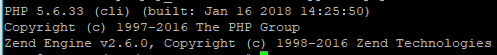
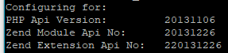
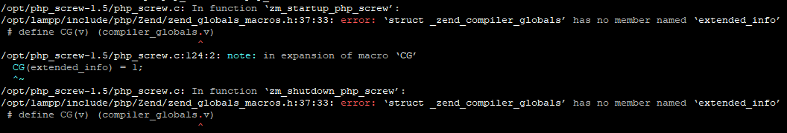
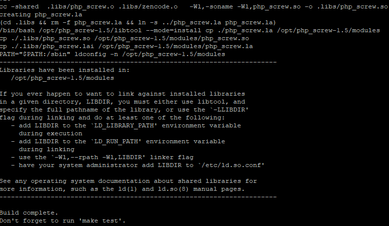
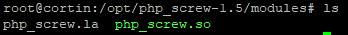
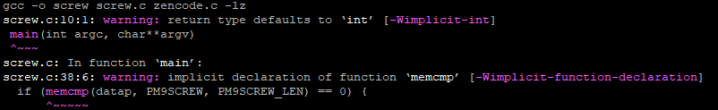
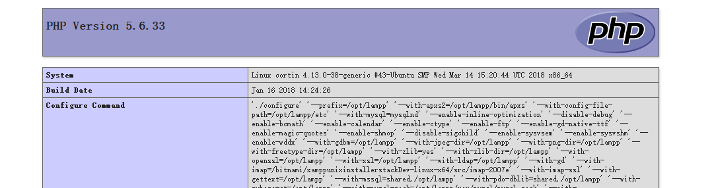

## 0 引言

最近在代码审计过程中遇到了 php_screw 的加密，PHP_Screw 是一款免费的针对 PHP 源码进行加密的 PHP 的扩展，可以自定义加密种子文件，加密后的文件效率还不会下降。

通过这次研究打算了解一下这方面的机制。

<!-- more -->

## 1 编译

首先从 SourceForge 下载源码`https://sourceforge.net/projects/php-screw/files/latest/download`
下好了之后是一个名为`php_screw-1.5.tar.gz`的文件，由于是初探 PHP 扩展，所以使用了这个比较简单的例子。源码结构也非常简单。我使用的 PHP 是 LAMPP 中自带的，查看一下版本



然后依次执行下列三条命令

```bash
phpize #编译PHP扩展的工具，主要是根据系统信息生成对应的configure文件
./configure --with-php-config=/usr/bin/php-config
make
```

我是用的是 LAMPP，所以要用对应的工具路径，也就是/opt/lampp/bin/中的 php 配置工具



然而在 make 的时候却报错了



错误信息主要是`error: ‘struct _zend_compiler_globals’ has no member named ‘extended_info’`

运气不错，有前人遇到过[相同的问题](http://www.bubuko.com/infodetail-726835.html)

只需要把 php_screw.c 文件中的`CG(compiler_options) |= ZEND_COMPILE_EXTENDED_INFO;`修改为`CG(compiler_options) |= ZEND_COMPILE_EXTENDED_INFO;`即可解决。

这里提供一条简单的命令执行这个操作，在 php_screw 的目录下执行即可完成。

```bash
sed -i "s/CG(extended_info) = 1;/CG(compiler_options) |= ZEND_COMPILE_EXTENDED_INFO;/g" php_screw.c
```

修改完成后就可以继续进行编译了，编译成功后应该如下图所示。





在 modules 生成 php_screw.so 库，扩展就编译完成了，接下来进入 tools 目录编译 screw，这个工具是用来把源码加密的。
直接用 make 命令编译即可。



## 2 测试

1. 首先写个简单的 phpinfo 用于测试`<?php phpinfo();?>`
2. 执行./screw test.php，加密成功结果为`Success Crypting(test.php)`，并且在当前目录多了一个`test.php.screw`保存了原来的代码。
3. 把加密好的 test.php 复制到网站目录中
4. 在/opt/lampp/etc/php.ini 中添加：`extension=/opt/php_screw-1.5/modules/php_screw.so`
5. 重启 apache
6. 访问服务器查看结果



如图所示，我们加密后的代码已经成功运行。

如果想要进行批量的加密，可以使用如下命令

```bash
find /data/php/source -name “*.php” -print|xargs -n1 screw //加密所有的.php文件
find /data/php/source -name “*.screw” -print|xargs -n1 rm //删除所有的.php源文件的备份文件
```

可以对/path/to/php/source 目录下的所有后缀为 php 的文件加密，包括子目录下的。
这样就基本做到的对 php 源码的加密。如果只是个人的小程序源码的加密，我想 php_screw 是一个不错的选择

## 3 加密原理

上面的内容主要是如何编译和部署 php_screw 扩展，下面来简单分析一下 php 扩展的编写和这种加密算法的实现
打开 tools 目录下的 screw.c 可以看到其主要流程

`打开目标文件→判断是否已经加密→创建备份文件→调用zencode进行压缩→使用pm9screw_mycryptkey进行加密→保存结果`

重点关注两个部分，即 zencode 函数和加密方式。其中，zencode 在同目录下的 zencode.c 中定义，与它一起的还有 zdecode 函数。

```C
char *zencode(char *inbuf, int inbuf_len, int *resultbuf_len)
{
    return zcodecom(0, inbuf, inbuf_len, resultbuf_len);
}

char *zdecode(char *inbuf, int inbuf_len, int *resultbuf_len)
{
    return zcodecom(1, inbuf, inbuf_len, resultbuf_len);
}
```

两个函数都调用了 zcodecom 函数，而传的第一个参数决定了是进行压缩还是解压。转到 zcodecom 函数，从几个函数，如：inflate、deflate，可以轻易的看出其使用的是 zlib 库，相关的原理和实现可以参见[_本链接_](https://blog.csdn.net/reage11/article/details/8519681)

而在 zencode 后的加密部分，只是使用了一个简单的语句把每一个字符进行了简单加密，如下所示

```C
for(i=0; i<newdatalen; i++) {
    newdatap[i] = (char)pm9screw_mycryptkey[(newdatalen - i) % cryptkey_len] ^ (~(newdatap[i]));
}
```

也就是把密文的每一位，按位取反之后，与 pm9screw_mycryptkey 数组中的一位做位异或操作。

## 4 总结

这个加密模块还是非常简单的，不过作为实验品却是正好，下面一篇将分析解密部分的实现，并且使用 Python 实现批量解密。
