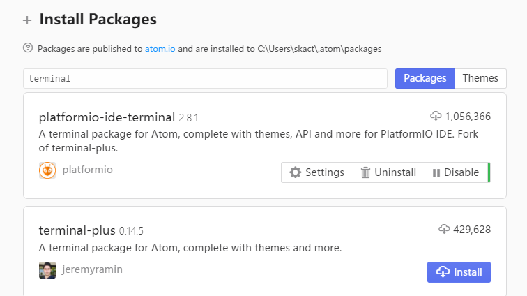
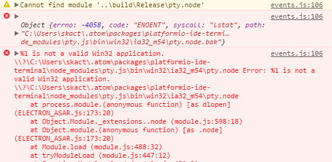
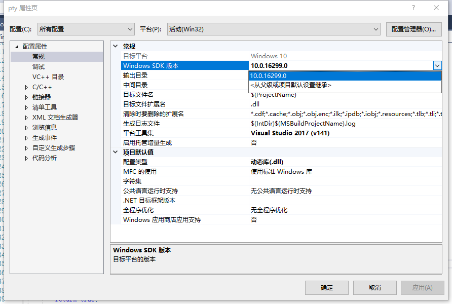
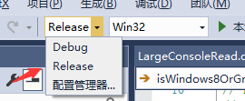
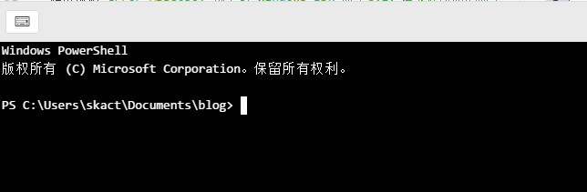
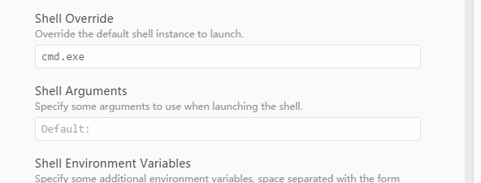
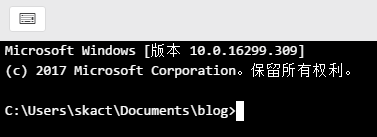

Atom 是 github 专门为程序员推出的一个跨平台文本编辑器。具有简洁和直观的图形用户界面，并有很多有趣的特点：支持 CSS，HTML，JavaScript 等网页编程语言。它支持宏，自动完成分屏功能，集成了文件管理器。
platformio-ide-terminal 插件为 Atom 提供了一个交互式终端，谨以此文记录我在安装这个插件时遇到的各种问题及解决办法。

<!-- more -->

在 Atom 的 Settings->Install->搜索 Terminal->Install 即可完成安装

重启 Atom 之后看一下，点击左下角的加号

尝试启动终端。

一片漆黑，很明显用不了，Ctrl+Shift+I 打开开发者工具

看到上述错误，那么主要问题应该就是`Cannot find module '..\build\Release\pty.node'`

这里我走了一些弯路，去尝试通过`.atom\packages\platformio-ide-terminal\node_modules\pty.js\bin\win32\ia32_m54\pty.node`这个文件解决问题，其实根本不需要。

只需要打开位于`%USERPROFILE%\.atom\packages\platformio-ide-terminal\node_modules\pty.js\build`目录下面的 building.sln，用 VS 编译一遍即可

如果报错`error MSB8036: 找不到 Windows SDK 版本8.1。请安装所需的版本的 Windows SDK 或者在项目属性页中或通过右键单击解决方案并选择“重定解决方案目标”来更改 SDK 版本。`只需要在下图位置选择你现在的系统版本即可。

还有就是编译时一定要选择`Release`版本，不然无法编译。

直接回到 Atom 中，再次点击加号或者使用快捷键**Ctrl+`**启动 Terminal

现在就可以使用了。

TIPS:
不习惯使用 PowerShell，可以进入插件的设置中，把默认的 PowerShell 改成 cmd.exe，如下图所示

再次启动就是 cmd 了

